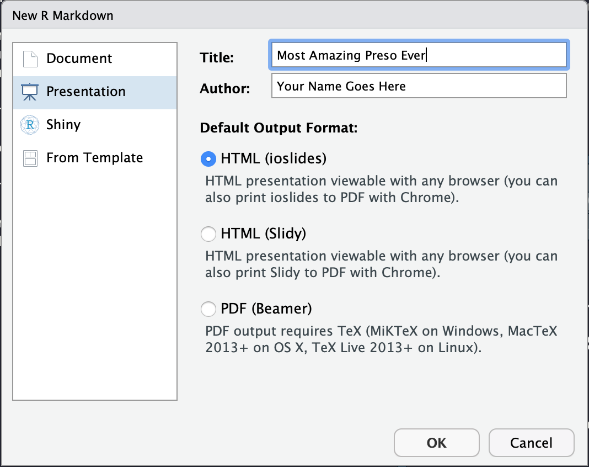

# Presentations in `R`

This repository provide a hands-on example of how `RMarkdown` can be used to create a slick presentation rendered as a HTML web page or an academic-style PDF presentation. 

## Getting Started 

Presentations are created from `RMarkdown` files. To start, open a new `RMarkdown` file and choose a presentation format. `RStudio` gives three options:



We will focus on `ioslides` for interactive presentations and `beamer` for more formal academic presentations. Both presentation packages follow the same syntax rules:

1. The title of the presentation should be specified in the header.
2. A new slide is denoted by double hashes (`##`)
3. Text and narrative 	are written in the lines between hashes. But beware: too much text might not fit on the page when the presentation is rendered
4. To insert code,  write this:  \`\`\`{r}. Then insert `R` code in the following line. To end the code chunk, add \`\`\`.
5. Adding `echo = FALSE` (e.g.  \`\`\`{r, echo = FALSE}) suppress actual code in the presentation but keeps the results. Given space constraints, this may be a wise thing to do.
6. Adding `message = FALSE, warning = FALSE` (e.g.  \`\`\`{r, echo = FALSE, message = FALSE, warning = FALSE}) suppresses warnings and messages from packages. For example, when loading a library, `R` will often times output a text message indicating which packages were loaded. If these options are not specified, they will appear in the slides.

## Presentation gist

When developing a presentation, try to keep the following in mind:

- *Start with big picture*. Have a good reason why people should pay attention. What is in it for them?
- *Roadmap*. Briefly discuss the outline of the talk, set expectations. 
- *Sections*. Start wide, then go deep. For each diagram/visual, there should always be a crisp one liner summary that can others can tell to others. At the end of each section, make sure to wrap up the concept and have a natural reason why you segue to the next section.

The example presentations in this section are focused on 

## Working with `ioslides`


### How to style the presentation

__Effects__. Most of the styling and functionality of a presentation are controlled in the YAML header.  In the header below, we include a set of arguments:

- `widescreen`: boolean,  if presentation should be standard or wide screen
- `smaller`: boolean, if text should be large or small
- `incremental`: boolean, if bullet points should appear one at a time (animation) or all at once (no animation)
- `transition`:  value to indicate how fast should slide transitions be. Choice of "default", "faster", "slower", or a numeric for seconds (e.g. 1, 2, 0.5).


```
---
title: "Insights about economic  "
author: "Author goes here"
date: "January 15, 2020"
output:
  ioslides_presentation:
    widescreen: true
    smaller: true
    incremental: false
    transition: slower
---
```

__Background__. 


### Some things to consider

- While HTML presentations are aesthetically pleasing, they can be somewhat challenging for non-technical collaborators if they are not familiar with programming and basic Markdown.
- Compatibility is limited to certain browsers. For example, `ioslides` works best with Google Chrome.
- Maintaining and styling the presentation requires knowledge of Cascading Style Sheets (CSS), which can be specified in the header of the Markdown file. 

## Working with `beamer`
 
 
### Styles

```
---
title: "Untitled"
author: "Jeff Chen"
date: "2/11/2020"
output: 
  beamer_presentation: 
    theme: Dresden
---
```

 

