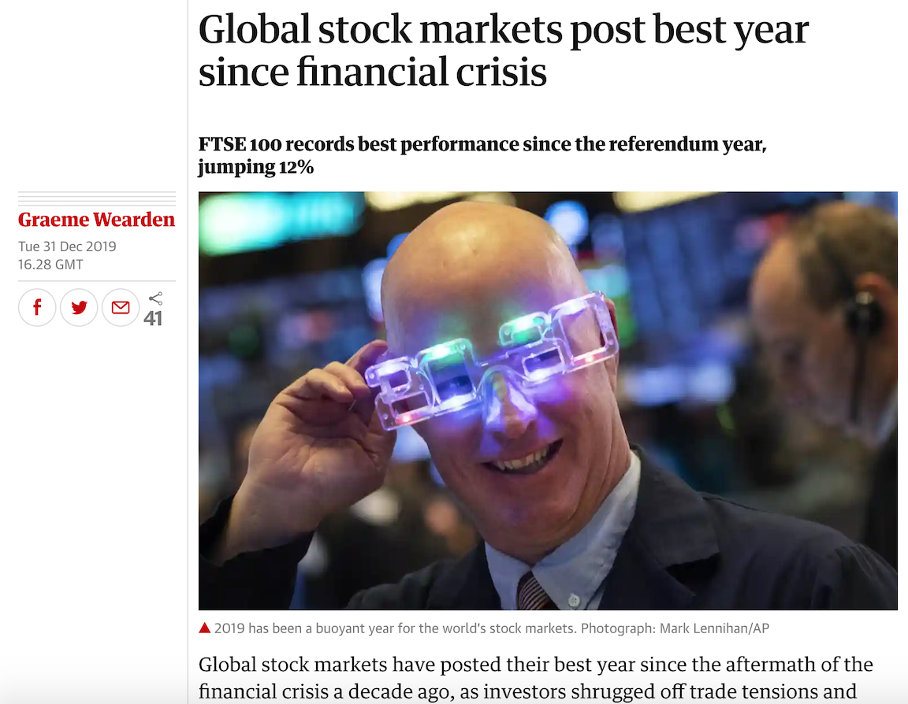
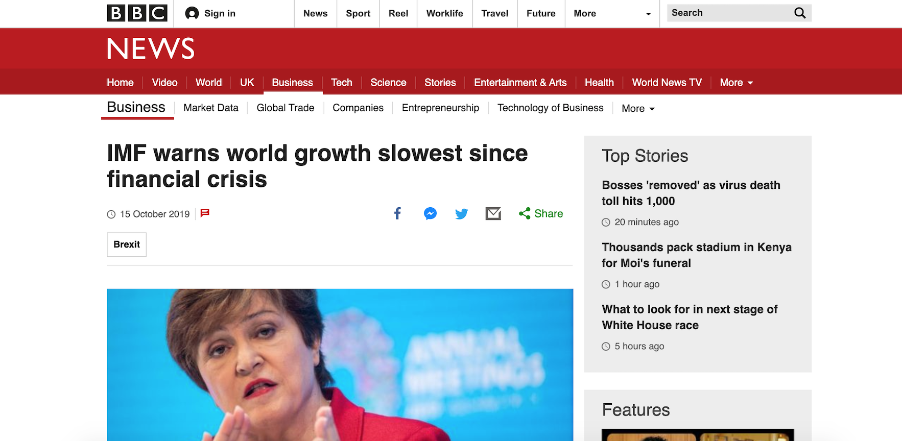
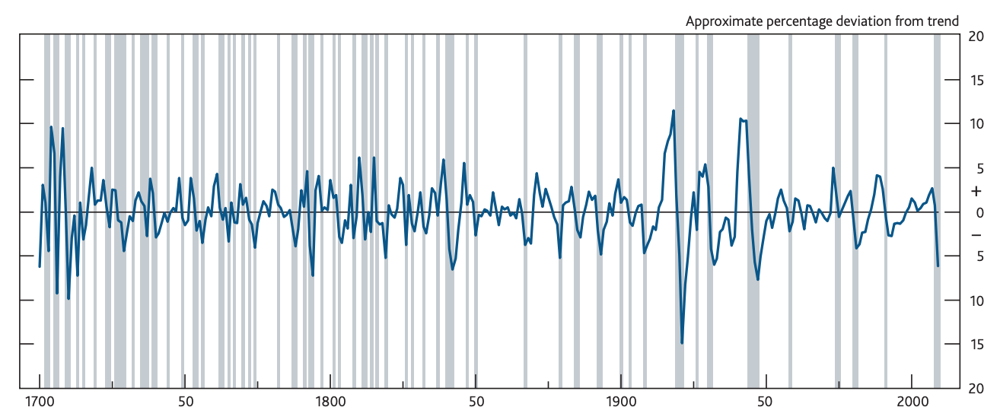
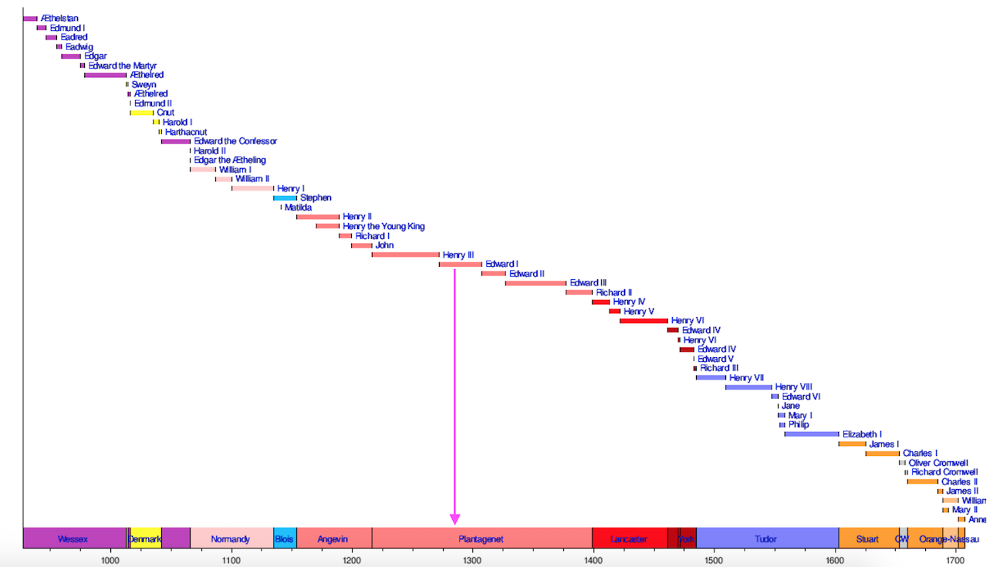

  
```{r setup, include=FALSE}
knitr::opts_chunk$set(echo = FALSE)
```

## Roadmap 

- __*Motivation*: Understanding growth__

- __*Analysis*: Examining how growth has evolved over centuries __

- __*Conclusions*: Why it matters__

# Motivation

## Context

Financial news outlets keep tabs on the economy, often times focusing on local highs and lows. For example, [The Guardian](https://www.theguardian.com/business/2019/dec/31/global-stock-markets-post-best-year-since-financial-crisis) reported:


```{r,  echo=FALSE, fig.width = 9}

```

## Context

Meanwhile the [BBC reported](https://www.bbc.com/news/business-50047929) that the International Monetary Fund warned of slowing growth relative to the time of the 2008 recession.


```{r,  echo=FALSE, , fig.width = 9, fig.height=6.21}

```


## Conventional Wisdom

Conventional investment advice states that one should __focus on the longer term__ -- invest money and let it grow as the economy keeps on growing. This is the upward gravity of the economy.

Is the financial news about growth actually __*newsworthy*__? 

Furthermore, is __*all growth the same*__?


## Look Into Antiquity

Let's take a look at a millennium of economic trends made available by the [Bank of England](https://www.bankofengland.co.uk/statistics/research-datasets). The data set contains centuries worth of data for available measures such as export and import volume, GDP, among other measures.

At first, this seems like a novelty, but it provides an opportunity to understand if all growth is the same. 


```{r,  echo=FALSE, fig.height=5, fig.cap = "UK GDP relative to a statistical trend(a) and dozens of annual recessions. "}

```


# Examining Growth

## Export Trade Data

We focus on *export trade data* for England that is available from 1286 AD to 2016 AD. 

To provide context, the data starts nearly halfway through the the House of Plantagenet, then spans dozens of English monarchs -- through highs and lows of English history.

```{r,  echo=FALSE, fig.height=5, fig.cap = ""}

```


## Export Volume

Over the $n=731$, we see a steep increase in export growth towards the tail end of the industrial revolution (exports in Billions of chained 2013 British Pounds). Export slowed during the two World Wars, then continued on a steep growth path with occassional dips (e.g. 2008 recession). 

```{r, echo = FALSE, warning=FALSE, message = FALSE, fig.width = 9}

#Load some packages
  pacman::p_load(forecast, ggplot2, gridExtra, dplyr)
  
#Import data
  exports <- read.csv("data/TVEXPUKA.csv")
  colnames(exports)[1:2] <- c("date", "target")
  exports <- exports[order(exports$date),]
  exports$time <- 1:nrow(exports) 
  exports$year <- as.numeric(format(as.Date(exports$date), "%Y"))

##Autoplot
  ggplot(exports) + 
    geom_line(aes(x = year, y = target/1000), colour = "purple") + 
    geom_area(aes(x = year, y = target/1000), 
              colour = "purple", fill = "purple") + theme_bw() + 
    ylab("Volume (Billions)") + xlab("Years")
  
```


## Export Growth

While the export volumes have grown, the year-to-year changes can be quite volatile. In fact, 36% of the time, exports have fallen. Thus, *while upward growth is the prevailing direction, it drops in growth are common. *

```{r, echo = FALSE, warning=FALSE, message = FALSE, fig.width = 9}

#Load some packages
  d_exports <- data.frame(year = exports$year[-1],
                          growth = diff(exports$target))
  d_exports$flags <- d_exports$growth < 0

##Autoplot
  a <- ggplot(d_exports) + 
    geom_line(aes(x = year, y = growth), colour = "purple", size = 0.1) + 
    geom_area(aes(x = year, y = growth), 
              colour = "purple", fill = "purple") + theme_bw() + 
    ylab("Change (Millions)") + xlab("Years") + ggtitle("Export Growth")
  
  b <- ggplot(filter(d_exports, year > 1800)) + 
    geom_line(aes(x = year, y = growth), colour = "purple", size = 0.1) + 
    geom_area(aes(x = year, y = growth), 
              colour = "purple", fill = "purple") + theme_bw() + 
    ylab("Change (Millions)") + xlab("Years") + ggtitle("Export Growth (After 1800)")
  
  grid.arrange(a, b, ncol = 2)
```


## Stability

Over time, the number of negative growth years per 20 years have fallen. Occassionally, there have been "bad" times, but overall improvement in stability.

```{r, echo = FALSE, warning=FALSE, message = FALSE, fig.width = 9}

#Calculate stability
  d_exports$quarter <- floor(d_exports$year/20)*20
  out <- aggregate(flags ~ quarter, data = d_exports, FUN = mean)

##Autoplot
  ggplot(out) + 
    geom_bar(stat = "identity", aes(x = quarter, y =  flags*100), 
              colour = "white", fill = "purple") + theme_bw() + 
    ylab("% Negative") + xlab("Years")
  
  
```

## Periods of growth

We can use a ML technique known as *Multi-Adaptive Regression Splines* (MARS) to identify pivotal dates when growth changed. MARS quantifies the growth trend along stretches of time -- hence *Splines*. 

In the graph below, the MAR algorithm found five pivotal dates -- 1818, 1948, 1968, 1993, and 2008. 


```{r, echo = FALSE, warning=FALSE, message = FALSE}
#Load
  pacman::p_load(earth, caret)

# create a tuning grid
  hyperparams <- expand.grid(
    degree = 1:3, 
    nprune = seq(5, 100, 5))


# cross validated model
  tuned_mars <- train(target ~ year, 
                    data = exports,
                      method = "earth",
                      trControl = trainControl(method = "cv", number = 30),
                      tuneGrid = hyperparams)

#Predict out
  master <- data.frame(year = exports$year,
                       target = exports$target,
                       yhat = predict(tuned_mars))
#Summary
  out1 <- summary(tuned_mars)
  out2 <- data.frame(Period = names(out1$coefficients[,1]),
                     Growth = out1$coefficients[,1])
  ggplot(out2) + 
    geom_bar(aes(x = Period, y = Growth), stat = "identity", fill = "purple", 
             colour = "purple") + theme_bw() + 
    ylab("Coefficients") + xlab("Breaks") + ggtitle("MARS Coefficients")

```


## Periods of growth: First 500 years

For the first 500 years of the sample, growth was relatively flat. 

```{r, echo = FALSE, warning=FALSE, message = FALSE, fig.width = 9}
a <- ggplot(filter(master)) + 
    geom_area(aes(x = year, y = target/1000), 
              colour = "purple", fill = "purple") + 
    geom_rect(aes(xmin = 1286, xmax = 1818, 
                  ymin = 0, ymax = max(master$target/1000)),
                  fill = NA, colour = "grey", size = 1, linetype = "dashed") +
    theme_bw() + 
    ylab("Export Volume (Billions)") + xlab("Years") + 
    ggtitle("Overall")

b <- ggplot(filter(master, year < 1818)) + 
    geom_area(aes(x = year, y = target/1000), 
              colour = "purple", fill = "purple") + 
    geom_line(aes(x = year, y = y/1000), colour = "grey", size = 2) + 
    theme_bw() + 
    ylab("Export Volume (Billions)") + xlab("Years")  + 
    ggtitle("1286 to 1818")

grid.arrange(a, b, ncol = 2)
```

## Periods of growth: 1818 onwards

From around 1818 onwards -- around the industrial revolution -- trade growth booms, adding 270 Million Pound Sterling per year. 


```{r, echo = FALSE, warning=FALSE, message = FALSE, fig.width = 9}
a <- ggplot(filter(master)) + 
    geom_area(aes(x = year, y = target/1000), 
              colour = "purple", fill = "purple") + 
    geom_rect(aes(xmin = 1818, xmax = 1948, 
                  ymin = 0, ymax = max(master$target/1000)),
                  fill = NA, colour = "grey", size = 1, linetype = "dashed") +
    theme_bw() + 
    ylab("Export Volume (Billions)") + xlab("Years") + 
    ggtitle("Overall")

b <- ggplot(filter(master, year < 1950 & year >= 1815)) + 
    geom_area(aes(x = year, y = target/1000), 
              colour = "purple", fill = "purple") + 
    geom_line(aes(x = year, y = y/1000), colour = "grey", size = 2) + 
    theme_bw() + 
    ylab("Export Volume (Billions)") + xlab("Years")  + 
    ggtitle("1818 to 1948")

grid.arrange(a, b, ncol = 2)
```

## Periods of growth: 1948 onwards

From 1948 onwards -- immediately after the Second World War -- export growth continues to accellerate by an additional +1558 Million Pounds per year.


```{r, echo = FALSE, warning=FALSE, message = FALSE, fig.width = 9}
a <- ggplot(filter(master)) + 
    geom_area(aes(x = year, y = target/1000), 
              colour = "purple", fill = "purple") + 
    geom_rect(aes(xmin = 1948, xmax = 1968, 
                  ymin = 0, ymax = max(master$target/1000)),
                  fill = NA, colour = "grey", size = 1, linetype = "dashed") +
    theme_bw() + 
    ylab("Export Volume (Billions)") + xlab("Years") + 
    ggtitle("Overall")

b <- ggplot(filter(master, year <= 1970 & year>=1945)) + 
    geom_area(aes(x = year, y = target/1000), 
              colour = "purple", fill = "purple") + 
    geom_line(aes(x = year, y = y/1000), colour = "grey", size = 2) + 
    theme_bw() + 
    ylab("Export Volume (Billions)") + xlab("Years")  + 
    ggtitle("1948 to 1968")

grid.arrange(a, b, ncol = 2)
```

## Periods of growth: 1968 onwards

From 1968 onwards -- a pivotal period around the world, exports continued to accelerate.


```{r, echo = FALSE, warning=FALSE, message = FALSE, fig.width = 9}
a <- ggplot(filter(master)) + 
    geom_area(aes(x = year, y = target/1000), 
              colour = "purple", fill = "purple") + 
    geom_rect(aes(xmin = 1964, xmax = 1996, 
                  ymin = 0, ymax = max(master$target/1000)),
                  fill = NA, colour = "grey", size = 1, linetype = "dashed") +
    theme_bw() + 
    ylab("Export Volume (Billions)") + xlab("Years") + 
    ggtitle("Overall")

b <- ggplot(filter(master, year <= 1993 & year>=1968)) + 
    geom_area(aes(x = year, y = target/1000), 
              colour = "purple", fill = "purple") + 
    geom_line(aes(x = year, y = y/1000), colour = "grey", size = 2) + 
    theme_bw() + 
    ylab("Export Volume (Billions)") + xlab("Years")  + 
    ggtitle("1968 to 1993")

grid.arrange(a, b, ncol = 2)
```

## Periods of growth: 1993 onwards

Trade agreements in the 1990's helped open more borders for trade. Technological innovation rapidly expanded during this time as well.


```{r, echo = FALSE, warning=FALSE, message = FALSE, fig.width = 9}
a <- ggplot(filter(master)) + 
    geom_area(aes(x = year, y = target/1000), 
              colour = "purple", fill = "purple") + 
    geom_rect(aes(xmin = 1993, xmax = 2008, 
                  ymin = 0, ymax = max(master$target/1000)),
                  fill = NA, colour = "grey", size = 1, linetype = "dashed") +
    theme_bw() + 
    ylab("Export Volume (Billions)") + xlab("Years") + 
    ggtitle("Overall")

b <- ggplot(filter(master, year <= 2010 & year>=1990)) + 
    geom_area(aes(x = year, y = target/1000), 
              colour = "purple", fill = "purple") + 
    geom_line(aes(x = year, y = y/1000), colour = "grey", size = 2) + 
    theme_bw() + 
    ylab("Export Volume (Billions)") + xlab("Years")  + 
    ggtitle("1993 to 2008")

grid.arrange(a, b, ncol = 2)
```

## Periods of growth: 2008 onwards

Export growth slowed significant after the 2008 recession.


```{r, echo = FALSE, warning=FALSE, message = FALSE, fig.width = 9}
a <- ggplot(filter(master)) + 
    geom_area(aes(x = year, y = target/1000), 
              colour = "purple", fill = "purple") + 
    geom_rect(aes(xmin = 2008, xmax = 2016, 
                  ymin = 0, ymax = max(master$target/1000)),
                  fill = NA, colour = "grey", size = 1, linetype = "dashed") +
    theme_bw() + 
    ylab("Export Volume (Billions)") + xlab("Years") + 
    ggtitle("Overall")

b <- ggplot(filter(master, year>=2005)) + 
    geom_area(aes(x = year, y = target/1000), 
              colour = "purple", fill = "purple") + 

    geom_line(aes(x = year, y = y/1000), colour = "grey", size = 2) + 
  
    theme_bw() + 
    ylab("Export Volume (Billions)") + xlab("Years")  + 
    ggtitle("2008 onwards")

grid.arrange(a, b, ncol = 2)
```

# What Does This Mean?

## 

While there has been significant progress in exports, it has experienced a relative slowdown in *recent* memory.

```{r, echo = FALSE, warning=FALSE, message = FALSE}

  ggplot(out2) + 
    geom_bar(aes(x = Period, y = Growth), stat = "identity", fill = "purple", 
             colour = "purple") + theme_bw() + 
    ylab("% Negative") + xlab("Years") + ggtitle("MARS Coefficients")

```
